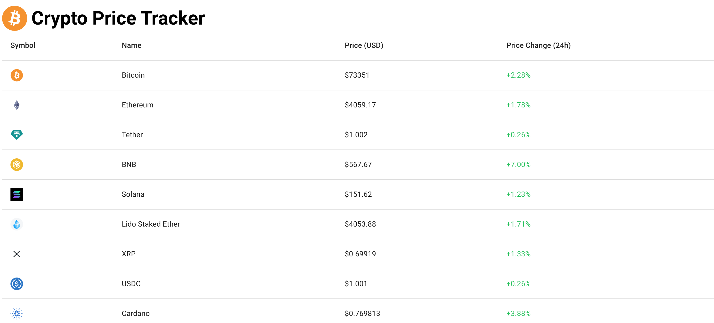

# Crypto Market Viewer 💰📈

Crypto Market Viewer is a web application built with React, Tailwind CSS and Coingecko Api that allows users to view the top cryptocurrencies and their price chart history.

## Features 🚀

- View the top cryptocurrencies Prices.

  <!-- Add empty lines or line breaks here

   -->

- View price chart history for different time periods.

## Project Images 

## Cryptocurrencies viewer

## Cryptocurrencies chart history

